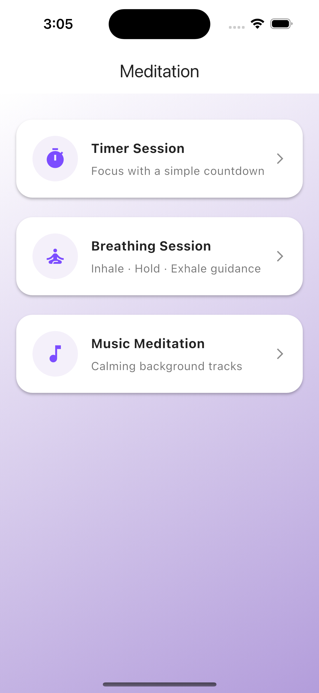
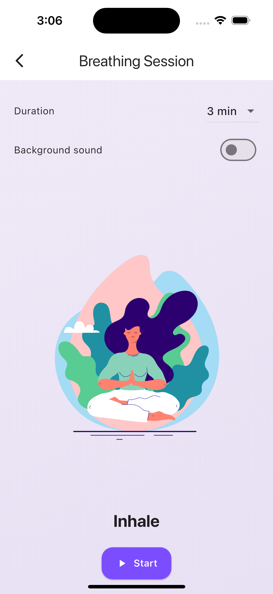
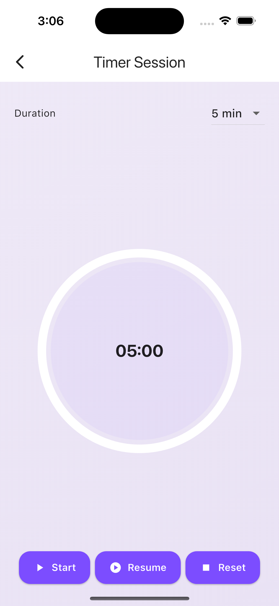

# 🧘‍♂️ meditation-app — Flutter Meditation App

> A calm and minimal meditation app built with **Flutter**, featuring guided breathing, timed meditation, and relaxing background music.  
> Designed with a soothing lavender theme for focus and mindfulness.

---

## 🌸 Features

✨ **Three Relaxation Modes:**

1. **Timer Meditation** — Set a meditation timer (3–15 mins) with a smooth countdown and gentle ending sound.
2. **Breathing Session** — Follow a guided inhale–hold–exhale animation for better mindfulness and focus.
3. **Music Meditation** — Listen to calming tracks (nature, ocean, rain) with adjustable duration.

🎨 **Beautiful UI:**

- Lavender & white theme for peace and focus.
- Smooth transitions and soft rounded components.

🎵 **Relaxing Sounds:**

- Built-in meditation sounds stored in `assets/audio/`.

📱 **Fully Responsive:**

- Works seamlessly on Android, iOS, and tablets.

---

## 🛠️ Tech Stack

- **Framework:** Flutter (latest stable SDK)
- **Languages:** Dart
- **Packages Used:**
  - `audioplayers` or `just_audio` → Background music
  - `circular_countdown_timer` → Timer animation
  - `lottie` or `rive` → Breathing animation
  - `provider` or `riverpod` → State management

---

## 🚀 Getting Started

### 1. Clone the Repository

```bash
git clone git@github.com:Dhruvrana8/meditation-app.git
```

### 2. Navigate to the Project Directory

```bash
cd meditation-app
```

### 3. Get Flutter Packages

```bash
flutter pub get
```

### 4. Run the App

```bash
flutter run
```

> 💡 _Make sure you have Flutter SDK installed and a connected device or emulator running._

---

## 📁 Project Structure

```
meditation-app/
│
├── assets/
│   ├── audio/          # Meditation & breathing sounds
│   ├── animations/     # Lottie or Rive breathing animations
│   └── images/         # App icons or illustrations
│
├── lib/
│   ├── main.dart       # Entry point
│   ├── screens/        # All screens (Home, Timer, Breathing, Music)
│   ├── widgets/        # Reusable UI components
│   ├── models/         # Data models
│   └── utils/          # Helpers & constants
│
└── pubspec.yaml
```

---

## 🎧 How to Use the App

1. **Open the app** and choose a mode:
   - 🕒 _Timer Meditation_
   - 🌬️ _Breathing Session_
   - 🎵 _Music Meditation_
2. **Select your duration** (3–15 mins).
3. **Relax and follow** the guided timer or breathing animation.
4. **Enjoy** the background sound or meditate in silence.

> ✨ You can pause, reset, or restart any session anytime.

---

## 🎨 Screenshots (Optional Section)

| Home Screen                     | Breathing Session                         | Timer Meditation                  |
| ------------------------------- | ----------------------------------------- | --------------------------------- |
|  |  |  |

---

## 🧩 Future Enhancements

- 🌓 Dark Mode toggle
- 🧘‍♀️ Daily Quotes or Affirmations
- 🔔 Reminder Notifications for meditation
- 💾 Local session tracking

---

## ❤️ Contributing

Pull requests are welcome!  
If you’d like to contribute:

1. Fork the repo
2. Create your feature branch (`git checkout -b feature-name`)
3. Commit changes (`git commit -m 'feat: add new feature'`)
4. Push and open a PR

---

## 📜 License

This project is licensed under the **MIT License** — feel free to use and modify it.

---
